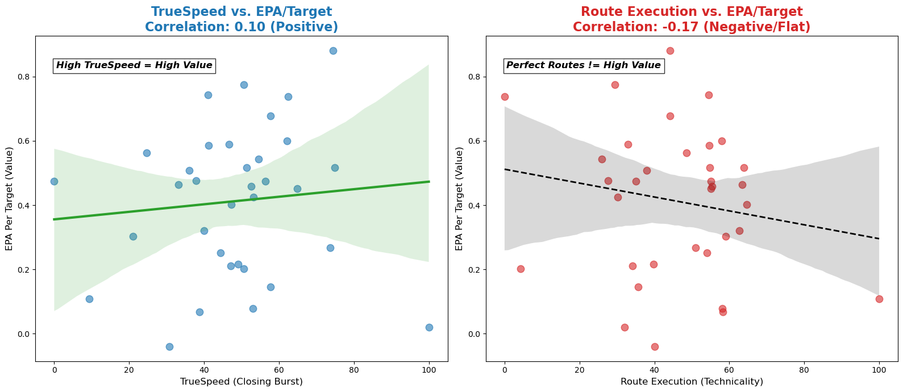

# Big Data Bowl: Receiver Movement, Separation, and Post-Throw Performance

This project explores advanced player-tracking analytics using the NFL Big Data Bowl dataset, with a focus on **wide receiver movement after the throw**, spatial convergence toward the ball, and contextual performance beyond traditional box-score metrics.

The work emphasizes **feature engineering, metric design, and model-based evaluation** of receiver behavior during pass plays, bridging raw tracking data and football-relevant insights.

---

## Project Motivation

Traditional receiving metrics such as yards, targets, and catches describe *outcomes*, but they do not fully capture:

- How well a receiver moves toward the ball
- How quickly separation is created or maintained
- How receiver performance varies by route, coverage, and game context

With player-tracking data, we can analyze **how a play unfolds in space and time**, rather than only how it ends. This project focuses on modeling and measuring those dynamics in a way that is interpretable and relevant to football decision-making.

---

## Analytical Focus

The analysis centers on post-throw behavior, specifically:

- Receiver movement trajectories after the ball is released
- Spatial convergence between receiver and ball landing location
- Defensive proximity and separation dynamics
- Contextual factors such as route type and coverage

Rather than treating plays as static events, the project models them as **continuous spatiotemporal processes**.

---

## Feature Engineering

Extensive feature engineering is applied to the raw tracking data, including:

- Receiver and defender positions, velocities, and directions
- Relative distances and angles between players and ball
- Time-aligned features from throw to catch/incompletion
- Normalization of play direction for consistency

These features form the basis for downstream modeling and metric construction.

---

## Modeling Approach

The project explores predictive and descriptive modeling approaches, including:

- Sequence-based models for post-throw movement
- Baseline regression and tree-based comparisons
- Residual-based metrics to isolate player contribution beyond expectation

Model outputs are used not only for prediction, but as **inputs to derived performance metrics**.

---

## Derived Metrics and Evaluation

A key objective is to move beyond binary outcomes (catch/no catch) and derive **continuous performance signals**, such as:

- Expected vs actual spatial convergence
- Separation quality over time
- Receiver efficiency relative to modeled expectation

These metrics are designed to be:
- Context-aware
- Comparable across players
- Interpretable for analysts and coaches

---

## Data

- **Source**: NFL Big Data Bowl player-tracking dataset
- **Granularity**: 10 Hz player and ball tracking
- **Scope**: Passing plays with receiver targets
- **Supplementary data**: Player metadata, play context, routes

---

## Sample Analysis Output

Figure: metric correlation view of derived receiver metrics with contextual features. There is a positive correlation between TrueSpeed and Expected Points Added (EPA), but a negative correlation between Route Execution and EPA.



---

## Repository Structure

```text
Big_Data_Bowl/
├── data/                # Processed and intermediate datasets
├── notebooks/           # Feature engineering, modeling, and analysis
├── outputs/             # Figures and analytical outputs
├── src/                 # Helper functions and reusable logic
└── README.md
```

---

## Key Insights Enabled

This framework enables analysts to:

* Evaluate receiver performance independent of catch outcome
* Compare players with similar box-score stats but different movement quality
* Understand how separation evolves post-throw
* Identify route and coverage contexts that amplify or suppress receiver effectiveness

---

## Current Scope and Future Work

### Current Scope

* Post-throw receiver movement analysis
* Feature-driven modeling of spatial dynamics
* Metric construction from model residuals

### Planned Extensions

* Broader route- and coverage-specific analysis
* Integration with team-level offensive tendencies
* Extension to multi-season comparisons
* Refinement of metrics for scouting and coaching applications

---

## Tech Stack

* Python
* Pandas, NumPy
* Scikit-learn
* Matplotlib, Plotly
* Jupyter Notebooks

---

## Notes

This repository represents a research-driven exploration of player-tracking analytics developed in the context of the NFL Big Data Bowl. The emphasis is on **translating complex spatiotemporal data into actionable football insights** through principled feature engineering, modeling, and metric design.
